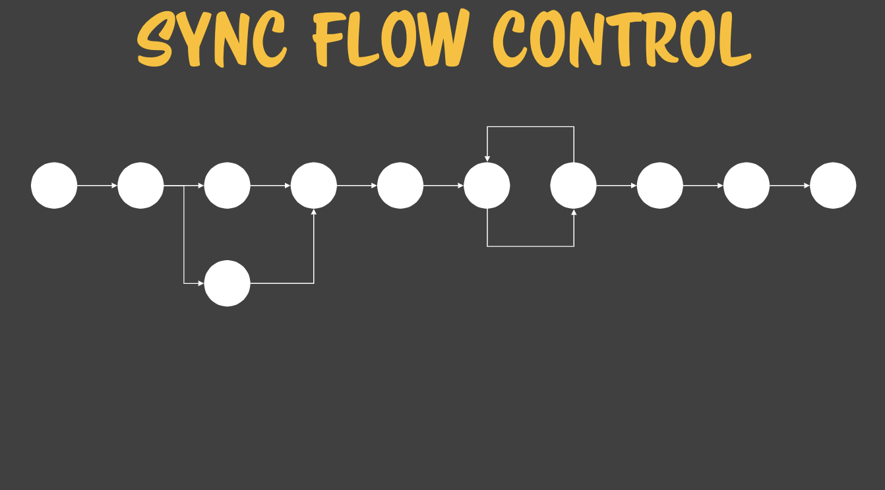
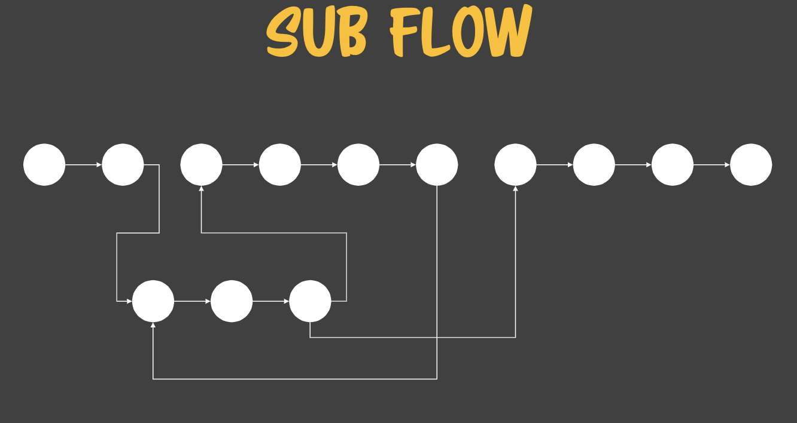

# javascript study

### 개발자와 공부하는 학생의 차이

- 복잡성을 정복하는 수단을 강구

### 프로그램이 어려운 이유

- 복잡하기 때문
- 모든 프로그램은 변함

### 프로그램이란?

- 컴퓨터에서 실행될 때 특정 작업을 수행하는 일련의 명령어들의 모음

## 1. Lexical grammar

자바스크립트란 언어는 어떤 기본 요소로 구성되어 있는가?
모든 프로그래밍 언어의 기본적인 문법을 정의하는 행위를 lexical grammer라고 함

1. control characters 제어문자
2. white space 공백문자 (총 47개)
3. line terminators 개행문자 (줄바꿈)
4. comments 주석
5. keywords 예약어 (인터프리터가 볼 때 이 단어들은 이미 예약되어 있다고 판단)
6. literals 리터럴 : 더 이상 나눌 수 없는 값의 표현 (true, 13, "abc"... )

## 2. Language element

### 1. statements 문

1. 공문, 식문, 제어문, 선언문
2. 단문, 중문

### 2. expression 식

- 하나의 값으로 귀결됌
- 식은 값이다.
  - 값은 저장하지 않으면 메모리에 휘발되어 없어짐

1. 값식, 연산식, 호출식

### 3. identifier 식별자

- 변수는 메모리 주소의 별명
- 변수는 해당 데이터 타입을 갖고 있음

1. 기본형, 참조형

- 값이 복사 primitive
  - undefined , null , boolean , number , string , symbol
- 값이 참조 reference
  - object

2. 변수, 상수

- [variable & data-type](./variable-datatype.md)

- 거의 모든 변수는 life cycle과 scope가 있음
- js에서는 scope를 사용함

  - scope = 접근 권한

## 3. Flow control

- javascript engine에게 주는 hint

- sync flow를 control
  

### - sync flow

- 관여할 수 없이 적재되어 있는 메모리의 명령어를 순서대로 실행하는 노이만 머신의 특징을 갖고 있음

### - sub flow



### 1. if 문

- 선택 사항
- optionary

- if라는 소문자 keyword
- white space가 n개 이상 올 수 있음
- 가로 다음 식이 옴
- 단문, 중문 둘다 올 수 있음

```js
if (ex) {
	statement;
}
```

### 2. if else 문

- 이지선다문
- mandatory

```js
if (true) 3;
else 5;
```

### 3. label, break, continue

- label은 흐름제어의 기본

- 같은 이름의 label을 사용하려면 function scope로 분기해야 함
- label identifier;

#### - function scope

- 자유 변수와 자유 변수가 아닌 재변수 사이에 이름이 같으면 자기 변수를 더 우선시한다.

```js
let a = 3;
const f = () => {
	let a = 5;
	log(a);
};
f();
```

#### - label scope

- 함수 바깥에 있는 label로 점프할 수 없음

```js
k1: {
	let a = 3;
	const f = () => {
		let a = 5;
		k: {
			break k1;
			log(37);
		}
		log(a);
	};
	f();
}
```

### 4. switch

- switch label block
- 진리표 만들때까지 쓰지 말자 복잡해진다!

```js
switch (key) {
	case value:
		break;

	default:
		break;
}
```

### 5. for 문

- 가로안에는 선언문이나 식, 공문이 올 수 있다.

```js
for (let index = 0; index < array.length; index++) {
	const element = array[index];
}
```

- 공문이면 항상 true임

```js
for (;;) {}
```

- 항상 true면 무한 loop

```js
while (truthy) {}
do {} while (truthy);
```

## 4. interface

- doctype을 구현하기 위한 프로토콜
- 인터페이스란 사양에 맞는 값과 연결된 속성 키의 set
- 어떤 object라도 인터페이스의 정의를 충족 가능
- 하나의 object는 여러개의 인터페이스를 충족 가능

### - interface test

1. test라는 키를 갖고
2. 값으로 문자열인자를 1개 받아 불린결과를 반환하는 함수가 나온다.

```js
{test: function(str){return true;}}
```

```js
const obj = {
	test(str) {
		return true;
	},
};

const Test = class {
	test(str) {
		return true;
	}
};

const test = new Test();
```

### - iterator interface

1. next라는 키를 갖고
2. 값으로 인자를 받지 않고 IteratorResultObject를 반환하는 함수가 온다.
3. IteratorResultObject는 value와 done이라는 키를 갖고 있다.
4. 이중 done은 계속 반복할 수 있을지 없을지에 따라 불린값을 반환한다.

```js
const iterator = {
	next() {
		return {
			done: true,
			value: 1,
		};
	},
};
```
